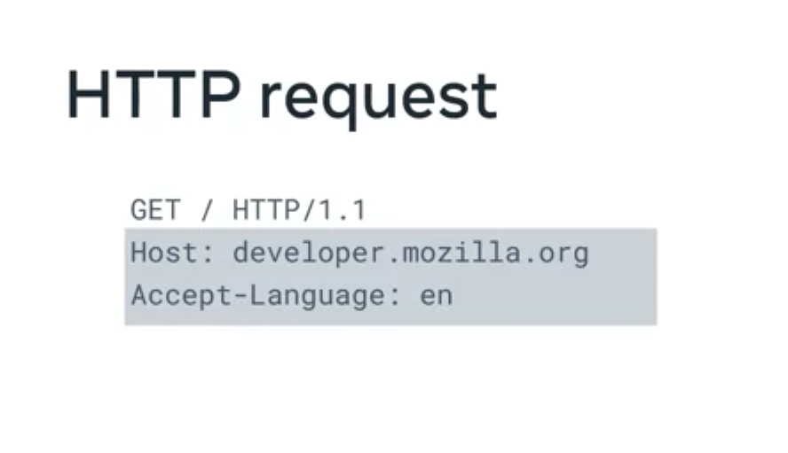

# Django Web Framework

<b>Course Name:</b> Django Web Framework
<b>Link:</b> [Django Web Framework](https://www.coursera.org/learn/django-web-framework)

<br>
<hr>
<br>

# Introduction to Django


## What is Django?

> Web application Framework -> Toolkit containing all the components need for application development.

Is a robust web framework, you can create front-end and back-end with Django. It is so powerful because you can use other python libraries that can create multiple things such as email notifications, dashboards, data analysis, etc. 

With Django developer can create ML algorithms that can be accesed with APIs, RPCs and Web Sockets. Scalable web applications, is good for memory and high volume apps, and that is why it is popular for apps like social media, traffic managment, magazines and blogs. And also you can create streaming apps.


<!-- 04/11/2024  -->
<!-- * How is Django Used in the real world? -->
<!-- * What do you hope to learn -->
<!-- * Course Syllabus -->
<!-- * Installing Python for Windows -->
<!-- * Installing Python for Mac -->
<!-- * Setting up a project with VS Code -->
<!-- * Project and apps overview -->

## How is Django used in the real world?
Django let you process HTTP request from end-user and eventually return content back to them. Django gives you exposure to what we call fullstack, you can learn how to interact with a database, and create a front end to the user. And you can add a web service in between.

### Course background
> The course is structured around the fictional Little Lemon restaurant. 

> The website was designed and coded with HTML and CSS and is currently presented as a single page.

> The restaurant owners Mario and Adrian want to explore the possibility of creating a database driven web application using the Django framework. 

> The owners would like to store the menu information in a database that can be updated by managers as the menu changes seasonally.
> 
>They have asked you to create a prototype of this website using the Django framework.

[Sillabus](https://www.coursera.org/learn/django-web-framework/supplement/LNFwv/course-syllabus
)


<!-- TODO New Concept -->
## Python Virtual Environment
>A virtual environment is an isolated environment having its copy of the interpreter and libraries so that there’s no clash with the global installation of Python

> DRY - Do not repeat yourself.

You can create a virtual environment in the specific project directory by running a command:

`py -m venv env`

env is the name assigned to the virtual environment and this will create a virtual Python installation in the env folder.

Next you need to activate the virtual environment. You will put the virtual environment-specific python and pip executables into your shell’s PATH.

`.\env\Scripts\activate`

You can exit the virtual environment by running the command:
`deactivate`

## Comands

``` python
python3 manage.py runserver # To run the server
python3 manage.py makemigrations # To compile the migrations
python3 manage.py migrate  # To migrate the changes in Database
pip3 install django # To install django in the virtual env.
```


<!-- 11/06/2024 -->
## What is a project?
When you set out to build a modular, extensible and scalable web application, you need an arrangement that controls the standard features of its various sub-modules.

A Django project is a Python package containing the database configuration used by various sub-modules (Django calls them apps) and other Django-specific settings.

Use the startproject command of Django-admin as follows:  
 `(djenv) C:\djenv>django-admin startproject demoproject `


## startapp
As mentioned above, a Django project folder can contain one or more apps. An app is also represented by a folder of a specific file system. The command to create an app is: 

python manage.py startapp <name of app>

You will explore the structure of an app later. 


## makemigrations

Django manages the database operations with the ORM technique. Migration refers to generating a database table whose structure matches the data model declared in the app. 

The following command should be run whenever a new model is declared. 

`python manage.py makemigrations`

## migrate

This command option of manage.py synchronizes the database state with the currently declared models and migrations.
`python manage.py migrate`

## runserver

This command starts Django’s built-in development server on the local machine with IP address 127.0.0.1 and port 8000.  
`python manage.py runserver`

## Shell

This command opens up an interactive Python shell inside the project. This is useful when you are required to perform some quick interactive operations. 
`python manage.py shell`

## Project package
The startproject command option of the Django-admin utility creates the folder of the given name, inside which there is another folder of the same name. For example, the command:
`django-admin startproject demoproject`
This creates a demoproject folder, inside which there’s another demoproject folder.

The inner folder is a Python package. For a folder to be recognized by Python as a package, it must have a file __init__.py. In addition, the startproject template places four more files in the package folder.


## Process of creating a Django Project
* Create project directory
* Create Virtaul environment
* Create Django project
* Run development server


<!-- 11/09/2024 -->
<!-- Django-admin & manage.py commands -->
<!-- App structures -->
<!-- What is a web framework -->
<!-- MVT Overview -->
## Django-admin & manage.py commands
Django-admin is Django's command line utility for administrative tasks. 
* It is located in the scripts folder of the Djangos environment directory.
* Executed from inside the terminal
* Created when installed Django.
* The Django admin utility should be in your system path if you installed Django via pip.
* If you dont have in the system path make sure you have your (env) activated and install it inside using a command such as `pip3 install Django`

Manage.py is a script that is the local version of django-admin, and it is located inside the project folder.
* It sets the Django settings module environment variable so that it points to your project settings.py file. 
* It is a file that is automatically created when you create a new project
* Specific to the virtual environment.

## What is a Django app?
[Apps](https://www.coursera.org/learn/django-web-framework/supplement/rDp6w/app-structures)

As mentioned above, an app is responsible for performing one single task out of the many involved in the complete web application, represented by the Django project. 

It implies that a project comprises many independent sub-applications, yet they may communicate among themselves.

## views.py
In Django, a view is a user-defined function that’s called when Django’s URL dispatcher identifies the client’s request URL and matches it with a URL pattern defined in the urls.py file.

The auto-created views file is empty at the beginning.

## urls.py
The project package has a file of this name that defines the URL patterns for the project. 

On similar lines, you need to provide the URL routing mechanism for the app. 

> One important thing to note here in contrast to the video you have seen earlier is that the urls.py file can be configured at both the project and app level. In the example below, the urls.py will be configured at both the project and app-level.

The app folder doesn’t have a file of this name when created. Hence, you have to create one.

## models.py
The data models required for processing in this app are created in this file. It is empty by default. A data model is a Python class based on django.db.modelsclass.All the models present here are migrated to the database tables.

## tests.py
You’ll write the tests to be run on the app in this file.

## Update settings.py
Lastly, you need to update the list of INSTALLED_APPS in the project’s setting file.

## What is a web framework?
Frameworks are designed to support the developer into creating a web application. 
* The purpose is to make application development easier.
* Provide a clean structure
* Change and modify 
* Code reusability

Front-end is the part the user interacts with the website functionality
Back-end is the processes that run in the web server.
    This usually has a database.

### The 3 tier architecture
Architecture refers to the fundamental structures of a software system and modern applications tend to be built in what is called the three-tier architecture.

* Presentation Tier. Layer that users primarily interact with through user interfaces like laptops, phone, etc. Its commonly create with a UI Framework or libray such as react.  And it communicates with the other tiers by sending results through the application interface. 
* Application Tier. Web server and application server, it is wath ties in the other two tiers.
* Data Tier. Usually are database servers for storing and retrieving information.


## MVT Overview

### MVC Architecture
Most of the web frameworks implement the MVC (Model-View-Controller) architecture. 

The MVC design pattern separates the entire web application development process into three layers, Model, View and Controller. 

The following diagram explains the interplay of these three layers


In the MVC approach, the controller intercepts the user requests. 

It coordinates with the view and model layers to send the appropriate response back to the client.

The model is responsible for data definitions, processing logic and interaction with the backend database.

The view is the presentation layer of the application.

It takes care of the placement and formatting of the result and sends it to the controller, which in turn, redirects it to the client as the application's response.

### MVT Architecture
The Django framework adapts a Model, View and Template (MVT) approach, a slight variation of the MVC approach.

Here too, the model is the data layer of the application. The view is, in fact, the layer that undertakes the processing logic.

The template is the presentation layer.


A Django application consists of the following components: 

URL dispatcher 

View 

Model 

Template 

#### URL dispatcher
Django's URL dispatcher mechanism is equivalent to the controller in the MVC architecture.

The urls.py module in the Django project's package folder acts as the dispatcher.

It defines the URL patterns. Each URL pattern is mapped with a view function to be invoked when the client's request URL is found to be matching with it.

The URL patterns defined in each app under the project are also included. Here’s the urls.py file in the app folder.

When the server receives a request in the client URL, the dispatcher matches its pattern with the patterns available in the urls.py. 

It then routes the flow of the application toward its associated view.

#### View
The view function reads the path, query, and body parameters included in the client's request If required, it uses this data to interact with the models to perform CRUD operations.

A view can be a user-defined function or a class.

You create View definitions in the views.pyfile of the respective app package folder. 

#### Model
A model is a Python class.  

An app may have one or more model classes, conventionally put in the models.py file. 

Django migrates the attributes of the model class to construct a database table of a matching structure.

Django's Object Relational Mapper helps perform CRUD operations in an object-oriented way instead of invoking SQL queries.

The view uses the client's and the model's data and renders its response using a template.

#### Template 
A template is a web page containing a mix of static HTML and Django Template Language code blocks.

You place Template web pages in the templates folder with the .html extension.

Django's template processor uses any context data from the view inserted in these blocks to formulate a dynamic response.

The view, in turn, returns the response to the user.


<!-- 11/13/2024
MVT Example
Practice Assignment
Module Summary
Moduel 2 Views 
Creating Views and mapping to URL
View Logic, Class based views, function based view, generic views
Creating views and view logic
-->

### Readings
* https://docs.djangoproject.com/en/4.1/
* https://docs.djangoproject.com/en/4.1/faq/general/#django-appears-to-be-a-mvc-framework-but-you-call-the-controller-the-view-and-the-view-the-template-how-come-you-don-t-use-the-standard-names

<!-- TODO Create Django doc POll app -->
* https://docs.djangoproject.com/en/4.1/intro/tutorial01/


# Module 2
## Views
A view is a function design to handle a web request. And return a web response. Such a HTML document.
We use them to process HTTP requests and return HTTP responses


<!-- 11/14/2023
Http requests
Request and response objetcts
Understangind Urls
 -->

## Http Requests and Response
Http is a core operational protocol of the worl wide web. It is what eneables your web browser to comunicate with a web server that host a website. (Hyper text transfer protocol).
It is a request, response based protocol.

### Http Request
An http request has a method, URL, version and headers.


Most commom methods are:
* GET
* PUT
* POST
* DELETE

The path is where the content is located on the server. 

And the headers contain information such as:
* Server name
* Server port
* Request method
* Content type

### Http Response
They follow a request similar to the request.


Optionally it contains a message body, consisting in the response content such as HTML file. 


#### Http Status Codes
Contained within the header, indicate if the HTTP request successfully completed
The codes are in the range from 100-599 and are group with pourpuse. 


And the status message is the text representation of the status code.


### Https
Is the secure version of http. It is used to send secure information between two computer so that nobody else can see what is sent and receive.
It does this by somethin called encription. 
The request and response has the same info, but the diference is that the content before is sent it is turned into a secret code. And only the other computer can turn the secret code into the original content.  

[Http Response and request objects in Django Lecture](https://www.coursera.org/learn/django-web-framework/supplement/DMTe5/request-and-response-objects)


## URL
Every single resource on the web is located by an address known as the uniform resource locator or URL.


* Scheme: is the protocol and is always at the beggining of the URL.
* Subdomian: located before the domain, usually contents the home page and other important pages, the most common is www (Worl wide web).
* Domain
  * Second-level domain
    * Refers to an organization or the name of a company
  * Top-level domain
    * Second part of the domain 
    * Used to reference a country or category of your organization
* File Path
  * Redirects you to a location of a resource
* Parameters
  * Also knwon as query strings, and are use to add additional information inside a URL